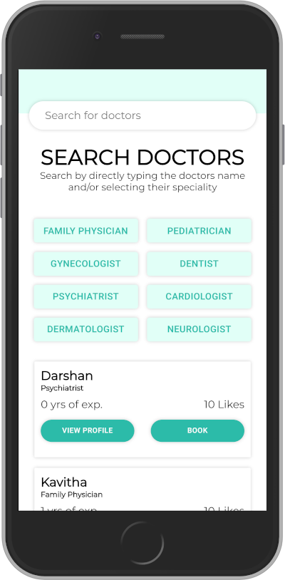

# Microverse Final Capstone Project

> A simple React-Redux application running on Rails.




[Design idea](https://www.behance.net/gallery/77208667/MediCo-Medical-mobile-app-UIUX-design?tracking_source=search%7Cmobile%20app) by [Vinisha Panjikar on Behance](https://www.behance.net/vinishapanjikar)

## Built With

- Ruby on Rails
- React
- Redux

## Live Demo

[Live on Heroku](https://microverse-capstone-final.herokuapp.com/)

## Getting Started

To get a local copy up and running follow these simple example steps.

## Setup

Clone this repository to your machine

```bash
git clone git@github.com:juzQrios/Microverse-final-capstone-project.git
cd Microverse-final-capstone-project
```

## Install

Install dependencies

```bash
bundle install
```

```bash
yarn install
```

## Start local server

In the project directory, run:

```bash
rails s
```

Optionally, start webpack dev server for JavaScript hot-relaod:

```bash
./bin/webpack-dev-server
```

View Admin Dashboard to manage Doctors list at [`http://localhost:3000/admin`](http://localhost:3000/admin)

View the application at [`http://localhost:3000`](http://localhost:3000)

## Authors

👤 **Darshan**

- Github: [@juzQrios](https://github.com/juzQrios)

> Additional support from [Microverse](https://www.microverse.org/) team.
