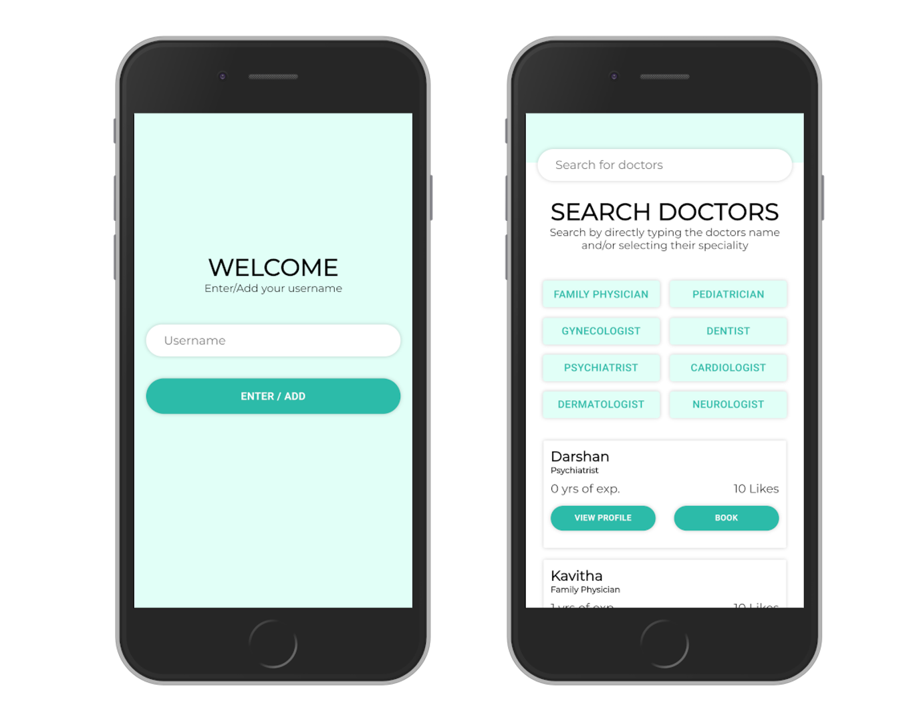

# Microverse Final Capstone

> A simple React-Redux application running on Rails.

[//]: # (Screenshot, Application concept art etc)


[//]: # (Live Demo link)
<p align="center">
  <a href="https://microverse-capstone-final.herokuapp.com/">Live Demo</a>
</p>

## Built With

* HTML
* CSS
* React
* Redux
* Ruby on Rails

## Get Started

### Setup

1. Clone this repository.

```bash
git clone git@github.com:juzQrios/microverse-final-capstone.git
cd microverse-final-capstone
```

2. Install dependencies.

```bash
bundle install --without production
yarn install
```

3. Start local server.

```bash
rails s
```

4. [Optional] Start Webpack dev server for JavaScript hot-relaod.

```bash
./bin/webpack-dev-server
```

5. View Admin Dashboard to manage Doctors list at <http://localhost:3000/admin>.
View the application at <http://localhost:3000>

### Tests

While it is a good practice to test code, this project doesn't have any tests right now but I might add them in future.

### Deployment

To deploy the application to Heroku, you can follow the [official docs](https://devcenter.heroku.com/articles/getting-started-with-rails6#deploy-your-application-to-heroku).

1. Create an app on Heroku.

```bash
heroku create
```

2. Deploy your code from `development` branch.

```bash
git push heroku development:master
```

3. Migrate your Database.

```bash
heroku run rake db:migrate
```

## Contributing

Contributions, issues and feature requests are welcome!

Feel free to checkout this project's [Kanban board](https://github.com/juzQrios/microverse-final-capstone/projects/1) or [issues page](https://github.com/juzQrios/microverse-final-capstone/issues).

## Acknowledgments

* App specification from [Microverse](https://www.microverse.org/).
* [Design](https://www.behance.net/gallery/77208667/MediCo-Medical-mobile-app-UIUX-design?tracking_source=search%7Cmobile%20app) by [Vinisha Panjikar](https://www.behance.net/vinishapanjikar) on Behance.

## License

This project is [MIT](./LICENSE) licensed.

## Authors

#### Darshan

* GitHub: [@juzQrios](https://github.com/juzQrios)
* Linkedin: [Darshan J](https://www.linkedin.com/in/jayadevdarshan/)
* Email: <dj30c.1@gmail.com>
